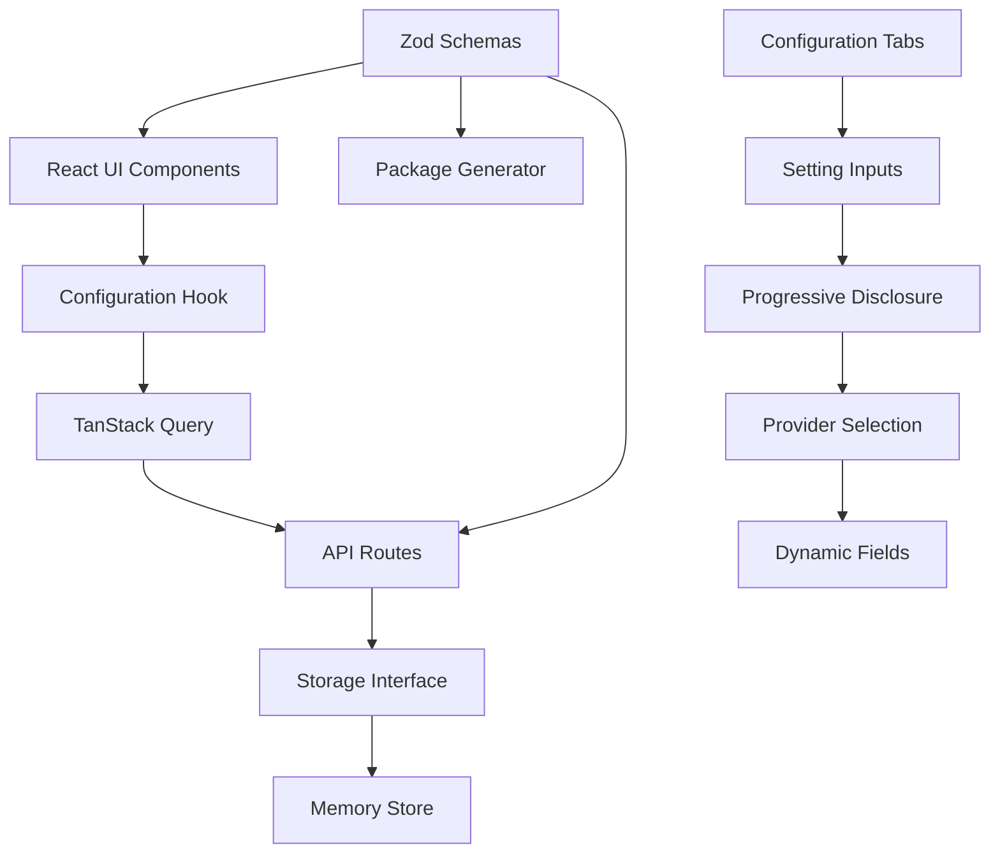

# LibreChat Configuration Tool

[](https://opensource.org/licenses/MIT)
[](http://makeapullrequest.com)
[](https://nodejs.org/)

A web-based interface to configure LibreChat v0.8.0 easily with progressive disclosure and comprehensive parameter coverage.

## Why This Exists

**LibreChat is incredibly powerful, but configuring it shouldn't require a PhD in YAML.** 

Setting up LibreChat involves managing 100+ configuration options across environment variables, YAML files, OAuth providers, database connections, AI API keys, file storage backends, email services, and more. The official docs are comprehensive but scattered across dozens of pages, making it easy to miss critical settings or misconfigure complex integrations.

**This tool solves that.** Instead of hunting through documentation and manually editing config files, you get:

- **Progressive disclosure** - Pick your providers first, then see only the relevant fields
- **Real-time validation** - Catch configuration errors before deployment  
- **Complete packages** - Generate all files needed for deployment in one click
- **Beginner-friendly** - No need to understand YAML syntax or environment variable conventions

**Built by the community, for the community.** As LibreChat evolves and adds new features, this tool evolves with it. Missing a new provider or configuration option? The codebase is designed to make adding support straightforward - just update the schemas and the UI follows automatically.

**Help make LibreChat accessible to everyone.** Whether you're fixing a bug, adding support for a new AI provider, or improving the user experience, your contributions help more people deploy and enjoy LibreChat without the configuration headaches.

## Prerequisites

- **Node.js 20+** (required)
  - **Windows**: Download from [nodejs.org](https://nodejs.org/) and install
  - **Mac**: `brew install node` or download from [nodejs.org](https://nodejs.org/)
  - **Linux**: Use your package manager or download from [nodejs.org](https://nodejs.org/)

**Verify installation:**
```bash
node --version  # Should show v20.x.x or higher
npm --version   # Should work without errors
```

## Quick Start

### Windows Users

**Option A: PowerShell (Recommended)**
```powershell
git clone https://github.com/Frits1/LibreChatConfigurator.git
cd LibreChatConfigurator
npm install; npm run dev
```

**Option B: Git Bash**
```bash
git clone https://github.com/Frits1/LibreChatConfigurator.git
cd LibreChatConfigurator
npm install && npm run dev
```

**Option C: WSL (If you prefer Linux environment)**
```bash
# Important: Copy to WSL filesystem to avoid permission issues
git clone https://github.com/Frits1/LibreChatConfigurator.git
cp -r LibreChatConfigurator ~/
cd ~/LibreChatConfigurator
npm install && npm run dev
```

### Mac/Linux Users

```bash
git clone https://github.com/Frits1/LibreChatConfigurator.git
cd LibreChatConfigurator
npm install && npm run dev
```

### All Platforms

**Open in browser:**
```
http://localhost:5000
```

4. **Configure your settings**
   - Use the clean tabbed interface with progressive disclosure
   - Configure only the providers you need (OAuth, Email, File Storage, etc.)
   - Set your AI API keys, database settings, and features

5. **Download your config files**
   - Get your `.env` file with environment variables
   - Get your `librechat.yaml` configuration file  
   - Get complete deployment package with Docker setup

## Production Build

For production deployment:

```bash
npm run build
npm start
```

The app will build and serve on port 5000 in production mode.

## Features

- **Progressive Disclosure**: Choose providers first, then see only relevant configuration fields
- **Comprehensive Coverage**: I have tried to catch all LibreChat v0.8.0 settings - see mapping below
- **Clean Interface**: Organized into logical tabs with search functionality
- **Real-time Validation**: Immediate feedback on configuration issues
- **Profile Management**: Save and load different configuration profiles
- **Complete Package Generation**: Ready-to-deploy files including Docker setup

## Supported Configuration Settings

This tool aims to support all LibreChat v0.8.0 configuration options. Here's what's currently covered:

**Based on [LibreChat Documentation](https://docs.librechat.ai/)**

### Core Settings (.env)
| Setting | Type | Documentation |
|---------|------|--------------|
| `APP_TITLE` | String | [Configuration](https://docs.librechat.ai/install/configuration/basic_config) |
| `CUSTOM_FOOTER` | String | [Configuration](https://docs.librechat.ai/install/configuration/basic_config) |
| `DOMAIN_CLIENT`, `DOMAIN_SERVER` | String | [Configuration](https://docs.librechat.ai/install/configuration/basic_config) |
| `HOST`, `PORT` | Server | [Configuration](https://docs.librechat.ai/install/configuration/basic_config) |
| `MONGO_URI`, `REDIS_URI` | Database | [Database Setup](https://docs.librechat.ai/install/configuration/mongodb) |
| `JWT_SECRET`, `JWT_REFRESH_SECRET` | Security | [Security](https://docs.librechat.ai/install/configuration/security) |
| `ALLOW_REGISTRATION`, `ALLOW_EMAIL_LOGIN` | Auth | [Authentication](https://docs.librechat.ai/install/configuration/authentication) |

### AI Provider API Keys (.env)
| Provider | Environment Variables | Documentation |
|----------|----------------------|--------------|
| OpenAI | `OPENAI_API_KEY` | [Providers](https://docs.librechat.ai/install/configuration/ai_setup) |
| Anthropic | `ANTHROPIC_API_KEY` | [Providers](https://docs.librechat.ai/install/configuration/ai_setup) |
| Google | `GOOGLE_API_KEY` | [Providers](https://docs.librechat.ai/install/configuration/ai_setup) |
| Azure OpenAI | `AZURE_OPENAI_*` | [Azure Setup](https://docs.librechat.ai/install/configuration/azure_openai) |
| AWS Bedrock | `AWS_*` | [Bedrock Setup](https://docs.librechat.ai/install/configuration/aws_bedrock) |
| 15+ Others | Various API keys | [AI Providers](https://docs.librechat.ai/install/configuration/ai_setup) |

### OAuth Providers (.env)
| Provider | Fields | Documentation |
|----------|--------|--------------|
| Google OAuth | `GOOGLE_CLIENT_ID`, `GOOGLE_CLIENT_SECRET` | [OAuth Setup](https://docs.librechat.ai/install/configuration/oauth) |
| GitHub OAuth | `GITHUB_CLIENT_ID`, `GITHUB_CLIENT_SECRET` | [OAuth Setup](https://docs.librechat.ai/install/configuration/oauth) |
| Discord, Facebook, Apple | Client credentials | [OAuth Setup](https://docs.librechat.ai/install/configuration/oauth) |
| OpenID Connect | Custom OIDC configuration | [OAuth Setup](https://docs.librechat.ai/install/configuration/oauth) |

### File Storage (.env)
| Strategy | Configuration | Documentation |
|----------|--------------|--------------|
| Local | `FILE_UPLOAD_PATH` | [File Handling](https://docs.librechat.ai/install/configuration/file_handling) |
| Firebase | `FIREBASE_*` credentials | [File Handling](https://docs.librechat.ai/install/configuration/file_handling) |
| Azure Blob | `AZURE_STORAGE_*` | [File Handling](https://docs.librechat.ai/install/configuration/file_handling) |
| Amazon S3 | `S3_*` credentials | [File Handling](https://docs.librechat.ai/install/configuration/file_handling) |

### Email Configuration (.env)
| Service | Fields | Documentation |
|---------|--------|--------------|
| SMTP | `EMAIL_SERVICE`, `EMAIL_USERNAME`, `EMAIL_PASSWORD` | [Email Setup](https://docs.librechat.ai/install/configuration/email) |
| Mailgun | `MAILGUN_API_KEY`, `MAILGUN_DOMAIN` | [Email Setup](https://docs.librechat.ai/install/configuration/email) |

### Search & RAG (librechat.yaml)
| Feature | Configuration | Documentation |
|---------|--------------|--------------|
| Web Search | `webSearch` providers (Serper, Brave, Tavily, etc.) | [Search](https://docs.librechat.ai/install/configuration/search) |
| MeiliSearch | `search`, `meilisearch*` settings | [Search](https://docs.librechat.ai/install/configuration/search) |
| RAG API | `ragApiURL`, RAG configuration | [RAG](https://docs.librechat.ai/install/configuration/rag_api) |

### Advanced Features (librechat.yaml)
| Category | Settings | Documentation |
|----------|----------|--------------|
| Interface | `interface.*` UI toggles and customization | [Configuration](https://docs.librechat.ai/install/configuration/basic_config) |
| Rate Limiting | `rateLimits.*` comprehensive limits | [Configuration](https://docs.librechat.ai/install/configuration/basic_config) |
| File Config | `fileConfig.*` upload limits and processing | [File Handling](https://docs.librechat.ai/install/configuration/file_handling) |
| Registration | `registration.*` domain restrictions | [Authentication](https://docs.librechat.ai/install/configuration/authentication) |
| Caching | Cache headers and static file settings | [Configuration](https://docs.librechat.ai/install/configuration/basic_config) |
| MCP Servers | `mcpServers.*` Model Context Protocol | [MCP](https://docs.librechat.ai/features/mcp) |

**Missing something?** Please open a PR! This tool is community-driven and welcomes contributions as LibreChat evolves.

**📚 Documentation Reference:**
- [LibreChat Configuration Guide](https://docs.librechat.ai/install/configuration)
- [Quick Start](https://docs.librechat.ai/install/quickstart)
- [Authentication Setup](https://docs.librechat.ai/install/configuration/authentication)
- [RAG API](https://docs.librechat.ai/install/configuration/rag_api)

## Architecture

This project follows a modern full-stack TypeScript architecture with clear separation of concerns:

```
LibreChat Configuration Tool
├── client/                 # React Frontend
│   ├── src/
│   │   ├── components/     # UI Components (Tabs, Forms, Inputs)
│   │   ├── lib/           # Utilities & Defaults
│   │   ├── hooks/         # React Hooks (useConfiguration)
│   │   └── pages/         # Route Components
│   └── index.html
├── server/                 # Express Backend
│   ├── routes.ts          # API Endpoints
│   ├── storage.ts         # Data Layer (Memory/Database)
│   └── vite.ts            # Development Server
├── shared/                 # Shared Types & Schemas
│   └── schema.ts          # Zod Validation Schemas
└── scripts/               # Build & Release Scripts
```

### Data Flow



### Key Components

- **Frontend**: React 18 + TypeScript, progressive disclosure UI, real-time validation
- **Backend**: Express.js API, Zod validation, pluggable storage interface  
- **Shared**: Type-safe schemas ensuring frontend/backend consistency
- **Package Generation**: Server-side `.env`, `librechat.yaml`, and Docker file creation

## For Developers

- **Frontend**: `/client` - React with TypeScript, Tailwind CSS, shadcn/ui components
- **Backend**: `/server` - Express.js with TypeScript
- **Shared**: `/shared` - Common types and schemas

Feel free to modify and improve! The codebase uses modern patterns and is designed to be easily extensible.

## Troubleshooting

### Common Issues

**❌ "Permission denied" error (Windows WSL)**
```bash
# Solution: Copy project to WSL home directory
cp -r /mnt/c/path/to/LibreChatConfigurator ~/
cd ~/LibreChatConfigurator
npm install && npm run dev
```

**❌ "node: command not found"**
- Install Node.js from [nodejs.org](https://nodejs.org/)
- Restart your terminal/command prompt after installation
- Verify with `node --version`

**❌ "The token '&&' is not a valid statement separator" (PowerShell)**
```powershell
# Use semicolon instead of && in PowerShell
npm install; npm run dev
```

**❌ "npm install" fails with permission errors**
- **Windows**: Run PowerShell as Administrator
- **Mac/Linux**: Don't use `sudo` with npm. Fix npm permissions or use [nvm](https://github.com/nvm-sh/nvm)

**❌ Port 5000 already in use**
```bash
# Kill process using port 5000
# Windows:
netstat -ano | findstr :5000
taskkill /PID <PID> /F

# Mac/Linux:
lsof -ti:5000 | xargs kill
```

**❌ Build fails or missing dependencies**
```bash
# Clean install
rm -rf node_modules package-lock.json
npm install
```

### Still having issues?
1. Check you have Node.js 20+ installed: `node --version`
2. Try the alternative installation method for your platform above
3. Open an issue on GitHub with your error message and platform details

## License

MIT License - Feel free to use, modify, and share!